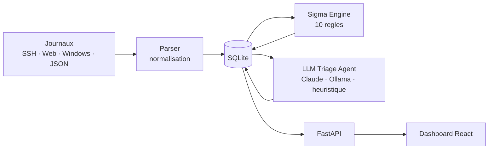

# SOC-AI

**Triage automatise des alertes de securite, par regles Sigma et LLM.**

[](https://github.com/OWNER/soc-ai/actions/workflows/ci.yml)
[](LICENSE)
[](https://www.python.org/)
[](https://docs.docker.com/compose/)

Les equipes SOC des PME et ETI recoivent des centaines d'alertes par jour, dont
la grande majorite sont des faux positifs. SOC-AI ingere vos journaux, applique
des regles Sigma, puis demande a un LLM de qualifier chaque alerte : criticite,
technique MITRE ATT&CK, resume et action concrete a mener. Le tout se deploie
en une commande et tient sur une seule machine.

> Remplacez `OWNER` par votre organisation GitHub dans les badges ci-dessus.

<!-- Ajoutez ici la capture du dashboard : docs/screenshot.png -->
<!-- Ajoutez ici le GIF de demonstration : docs/demo.gif -->

---

## Demarrage rapide

```bash
git clone https://github.com/OWNER/soc-ai.git && cd soc-ai
cp .env.example .env          # optionnel : ajoutez votre cle ANTHROPIC_API_KEY
cp samples/* logs/            # jeu de journaux de demonstration
docker compose up --build -d
```

Dashboard : <http://localhost:3000> — API et documentation OpenAPI : <http://localhost:8000/docs>

Sans cle API, l'agent bascule automatiquement sur un moteur de triage
heuristique deterministe. La demonstration fonctionne donc hors ligne, sans
compte et sans cout.

## Ce que fait SOC-AI

- **Ingestion** de journaux SSH, Apache/Nginx, Windows Event Log XML et JSON, avec suivi d'offset pour ne jamais rejouer une ligne deja lue.
- **Detection** par regles Sigma, y compris les regles a seuil glissant (par exemple 6 echecs SSH en 60 secondes depuis la meme source) et les regles a exclusion.
- **Triage** par LLM : severite, type d'attaque, identifiant MITRE ATT&CK, indice de confiance, resume et recommandation en francais, plus une estimation du risque de faux positif.
- **Console web** : file d'alertes filtrable, posture sur 24 heures, detail complet du triage et du journal brut, export JSON.
- **Trois moteurs de triage interchangeables** : API Claude, Ollama local pour un deploiement souverain, ou heuristique embarquee.

## Architecture



Les quatre modules Python ne se parlent jamais directement : la base SQLite est
le seul point d'integration. Chaque module peut donc etre arrete, redemarre ou
remplace sans toucher aux autres. Le detail des tables et du contrat de triage
est documente dans [docs/architecture.md](docs/architecture.md).

| Module | Technologie | Role |
|---|---|---|
| `parser/` | Python 3.11 | Surveille `/logs`, normalise chaque ligne en evenement |
| `engine/` | Python + PyYAML | Evalue les regles Sigma et produit les alertes |
| `llm_agent/` | Python + Requests | Qualifie chaque alerte et remplit le contrat de triage |
| `api/` | FastAPI | Expose `/alerts`, `/stats`, `/export`, `/rules` |
| `dashboard/` | React 18 + Tailwind | Console d'analyste servie par nginx |

## Regles de detection incluses

| ID | Regle | Niveau | MITRE |
|---|---|---|---|
| SSH-001 | Brute force SSH, plus de 5 echecs en 60 s | HIGH | T1110.001 |
| SSH-002 | Connexion root directe en SSH | HIGH | T1078.003 |
| SSH-003 | Connexion SSH depuis une IP hors plage interne | MEDIUM | T1078 |
| WEB-001 | Motif d'injection SQL dans une URL | HIGH | T1190 |
| WEB-002 | Path traversal | MEDIUM | T1083 |
| WEB-003 | Scanner HTTP identifie par son User-Agent | LOW | T1595 |
| WIN-001 | Escalade de privileges Windows, event 4672 | CRITICAL | T1078 |
| WIN-002 | Creation de compte Windows, event 4720 | MEDIUM | T1136.001 |
| WIN-003 | Acces a la ruche SAM | CRITICAL | T1003.002 |
| NET-001 | Balayage de ports, plus de 20 ports en 5 s | HIGH | T1046 |

Ajouter une regle revient a deposer un fichier YAML dans `engine/rules/`. Le
moteur prend en charge les modificateurs `contains`, `startswith`, `endswith`,
`re` et `gte`, les listes de valeurs en OU, les conditions `selection and not
filtre`, et l'agregation `count() by champ > N` associee a un `timeframe`.

## Contrat de triage

Chaque alerte qualifiee expose exactement ces champs, quel que soit le moteur
utilise. Les valeurs hors domaine renvoyees par un modele sont rejetees et
remplacees par la severite de la regle, ce qui garantit que l'API ne sert
jamais de donnee invalide.

```json
{
  "severity": "HIGH",
  "attack_type": "Brute Force SSH",
  "mitre_id": "T1110.001",
  "confidence": 92,
  "summary": "Tentative de brute force SSH detectee depuis 45.83.64.12. 8 occurrences dans la fenetre de detection.",
  "recommendation": "Bloquer l'IP source au niveau du pare-feu et activer fail2ban.",
  "false_positive_risk": "LOW"
}
```

## Codes couleur de la console

| Severite | Couleur | Delai de traitement attendu |
|---|---|---|
| CRITICAL | `#FF0000` | Intervention immediate, moins de 15 min |
| HIGH | `#FF6600` | Traitement dans l'heure |
| MEDIUM | `#FFB300` | Traitement dans la journee |
| LOW | `#0066CC` | Revue hebdomadaire |
| INFO | `#666666` | Archivage, pas d'action |

## API

| Methode | Route | Description |
|---|---|---|
| GET | `/alerts` | Liste paginee, filtres `severity`, `rule_id`, `source_ip`, `since_hours` |
| GET | `/alerts/{id}` | Detail d'une alerte et de l'evenement d'origine |
| GET | `/stats` | Compteurs par severite, par regle et par source sur une fenetre glissante |
| GET | `/export` | Export JSON telechargeable des alertes filtrees |
| GET | `/rules` | Regles ayant declenche au moins une fois |
| GET | `/health` | Sonde de disponibilite |

```bash
curl "http://localhost:8000/alerts?severity=CRITICAL&limit=5"
curl "http://localhost:8000/export?since_hours=24" -o alertes.json
```

## Developpement

```bash
pip install -r parser/requirements.txt -r engine/requirements.txt \
            -r llm_agent/requirements.txt -r api/requirements.txt
pip install pytest httpx ruff

python -m pytest tests/ -v     # 37 tests
ruff check .
```

Pipeline complet sans Docker, utile pour deboguer une regle :

```bash
export SOCAI_DB=/tmp/socai.db
python parser/parser.py --dir samples --once
python engine/engine.py --once
python llm_agent/agent.py --once
uvicorn main:app --app-dir api --reload
```

Console en mode developpement : `cd dashboard && npm install && npm run dev`.

## Confidentialite et donnees personnelles

Les journaux de securite contiennent des donnees personnelles. Avant tout envoi
vers un LLM cloud, SOC-AI masque les adresses e-mail et tronque le journal brut.
Positionnez `SOCAI_SEND_IP=false` pour masquer aussi les adresses IP, ou
utilisez Ollama pour que rien ne quitte votre reseau. Definissez une duree de
retention adaptee a votre analyse d'impact. Voir [SECURITY.md](SECURITY.md).

## Feuille de route

- **v1.5** — alertes Slack et Microsoft Teams, score de risque cumulatif par source, 50 regles supplementaires, rapport hebdomadaire PDF.
- **v2.0** — tableau de conformite NIS2 article 21, connecteur Elastic et OpenSearch, mode multi-tenant pour les MSSP.
- **v3.0** — reponse automatisee (blocage d'IP, mise en quarantaine), cartographie ATT&CK visuelle, specialisation du modele sur des alertes reelles anonymisees.

## Contribuer

Les contributions sont bienvenues, en particulier les nouvelles regles Sigma et
les parsers de formats supplementaires. Lisez [CONTRIBUTING.md](CONTRIBUTING.md)
pour la procedure et les conventions.

## Licence

MIT. Voir [LICENSE](LICENSE).
