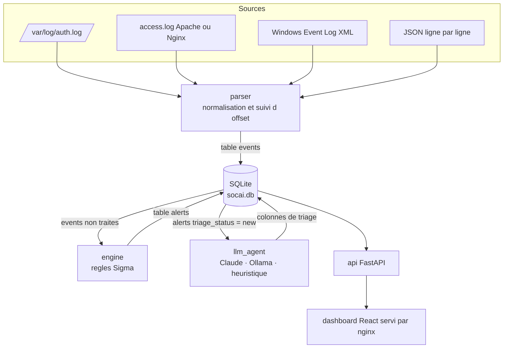

# Architecture technique

## Principe directeur

Quatre modules Python et une console web. Aucun module n'appelle un autre
module : la base SQLite est le seul point d'integration. Un module peut donc
tomber, etre redemarre ou remplace sans casser la chaine, et chaque etape est
rejouable a la main pendant une investigation.

## Cycle de vie d'une alerte

1. Le parser lit les nouvelles lignes de chaque fichier de `/logs` a partir de l'offset memorise dans la table `cursors`, et ecrit un evenement normalise avec `processed = 0`.
2. Le moteur consomme les evenements non traites par lots de 500, evalue les dix regles, ecrit les alertes puis marque le lot comme traite.
3. L'agent prend les alertes `triage_status = 'new'`, les qualifie et bascule leur statut a `triaged`.
4. L'API sert la vue consolidee, la console interroge `/stats` et `/alerts` toutes les dix secondes.

Chaque etape est idempotente : relancer un module ne cree pas de doublon, car
l'avancement est materialise en base (offset de lecture, drapeau `processed`,
statut de triage) et non en memoire.

## Schema de donnees

**events** — evenement normalise, quel que soit le format d'origine.

| Colonne | Type | Note |
|---|---|---|
| `id` | INTEGER | cle primaire |
| `timestamp` | TEXT | ISO 8601, issu du journal |
| `source_ip`, `user`, `action` | TEXT | champs pivots des regles |
| `source_type` | TEXT | `ssh`, `web`, `windows`, `json` |
| `extra` | TEXT | JSON specifique au format (event_id, user_agent, path_decoded...) |
| `raw_log` | TEXT | ligne d'origine, conservee pour l'investigation |
| `processed` | INTEGER | drapeau de consommation par le moteur |

**alerts** — resultat de la detection, enrichi par le triage.

| Groupe | Colonnes |
|---|---|
| Detection | `rule_id`, `rule_name`, `rule_severity`, `event_id`, `source_ip`, `user`, `timestamp`, `raw_log`, `match_count` |
| Triage | `triage_status`, `severity`, `attack_type`, `mitre_id`, `confidence`, `summary`, `recommendation`, `false_positive_risk`, `triage_engine`, `triaged_at` |

La severite de la regle et celle du triage sont conservees separement. On peut
ainsi mesurer combien de fois le modele rehausse ou abaisse le niveau initial,
ce qui est la mesure de valeur du triage automatique.

## Moteur de regles

Sous-ensemble de Sigma volontairement restreint a ce qui est utile ici.

- Selections a plusieurs champs combines en ET, valeurs multiples en OU.
- Modificateurs `contains`, `startswith`, `endswith`, `re`, `gte`.
- Resolution de champ en cascade : colonne de la table, puis cle du JSON `extra`.
- Condition simple `selection`, condition a exclusion `selection and not filtre`, agregation `selection | count() by champ > N` avec `timeframe`.

L'agregation utilise une fenetre glissante a deux index sur les evenements du
groupe tries par horodatage, en complexite lineaire. Un seul evenement est emis
par groupe et par lot : une attaque de mille tentatives produit une alerte, pas
mille.

## Agent de triage

Trois moteurs, essayes dans l'ordre, avec repli automatique en cas d'echec :

| Moteur | Condition d'activation | Usage |
|---|---|---|
| Claude | `ANTHROPIC_API_KEY` renseignee | qualite maximale, resume en langage naturel |
| Ollama | `OLLAMA_HOST` renseignee | deploiement souverain, aucune sortie reseau |
| Heuristique | toujours disponible | demonstration, CI, mode degrade |

La sortie du modele est systematiquement validee : severite et risque de faux
positif contraints a leur domaine, confiance bornee entre 0 et 100, chaines
tronquees, `mitre_id` normalise. Une reponse invalide retombe sur la severite de
la regle plutot que d'echouer. C'est ce qui permet a l'API de garantir un
contrat stable a la console.

## Choix techniques et limites assumees

| Choix | Raison | Limite |
|---|---|---|
| SQLite plutot que PostgreSQL | zero configuration, un seul fichier a sauvegarder, deploiement en 5 minutes | un seul ecrivain a la fois, plafond aux alentours de quelques millions d'evenements |
| Sondage plutot que file de messages | aucune dependance supplementaire, comportement previsible | latence de quelques secondes entre ingestion et alerte |
| Pas d'authentification en v1.0 | perimetre du sprint | l'API doit rester sur un reseau de confiance, voir SECURITY.md |
| Journaux montes en lecture seule | le collecteur ne doit jamais alterer la preuve | la rotation doit etre geree par l'hote |

## Depannage

| Symptome | Piste |
|---|---|
| Aucun evenement ingere | verifier que les fichiers sont bien dans `logs/` et lisibles, puis `docker compose logs parser` |
| Evenements presents mais aucune alerte | le format ou le nom du fichier ne correspond pas au parser attendu, voir `detect_format` |
| Alertes bloquees en `new` | le conteneur `llm_agent` est arrete, ou l'appel LLM echoue en boucle, voir ses journaux |
| La console affiche "API injoignable" | le conteneur `api` n'est pas demarre, tester `curl localhost:8000/health` |
| Une regle ne se declenche jamais | rejouer `python engine/engine.py --once` sur une base de test et inspecter la table `events` |
